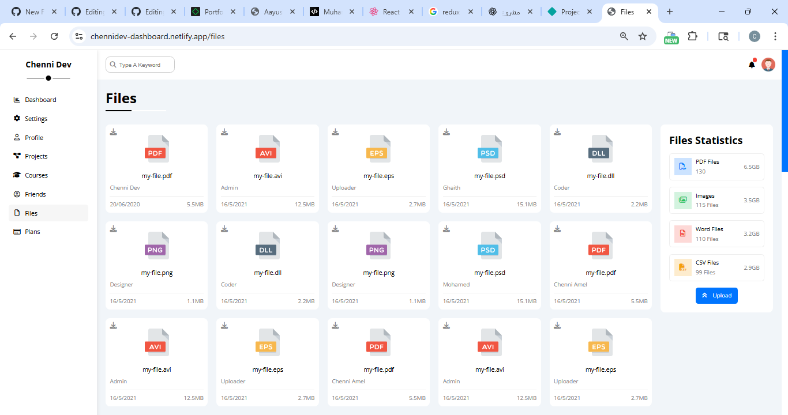
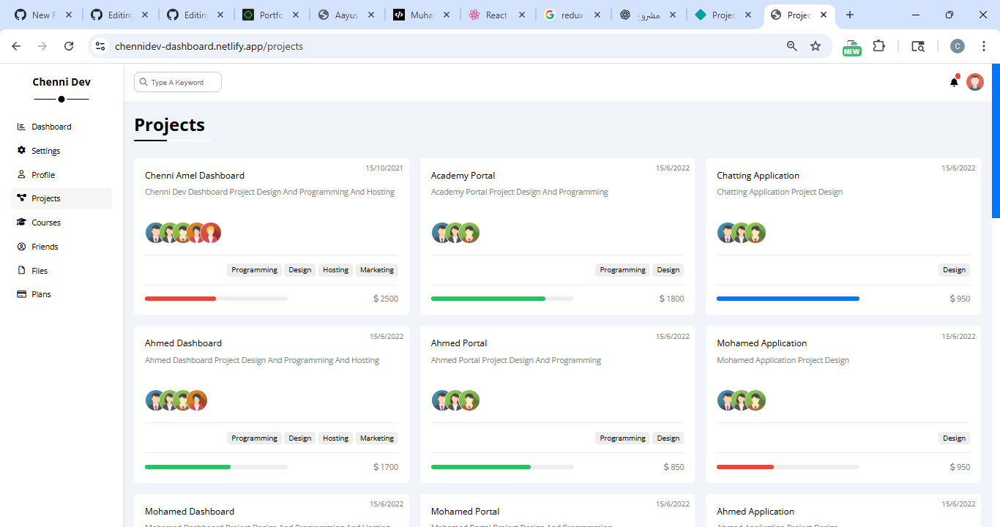

# 📊 Dashboard Project

🌐 **Live Demo:** [https://chennidev-dashboard.netlify.app/](https://chennidev-dashboard.netlify.app/)

---

## 📖 Description  
A responsive **Dashboard UI** built only with **HTML, CSS, and JavaScript**.  
The project contains multiple pages to simulate a real dashboard system with clean and modern design.  

---

## 🚀 Features  
- 📋 Multiple pages (Plans, Users, Analytics, Login, Dashboard Home, etc.)  
- 🎨 Modern responsive design using pure CSS  
- 📱 Mobile-first responsive layout  
- ⚡ Lightweight – no frameworks (only HTML, CSS, JavaScript)  
- 🔄 Easy to customize and extend  

---

## 🛠️ Technologies Used  
- **HTML5**  
- **CSS3** (Flexbox, Grid, custom styling)  
- **JavaScript (Vanilla)**  

---

## 📷 Preview  
### 📊 home Page  
  

### 🔑 Courses Page  
  

### 🏠 File Home  
  

### 👥 Projects Page  
  


---

## 📌 Future Improvements  
- Add **dark/light mode**  
- Add **animations & transitions** for smoother UX  
- Connect pages to a real backend (authentication, database)  
- Add **interactive charts**  

---

## ▶️ Usage  
1. Clone this repository:  
   ```bash
   git clone https://github.com/AmelChenni/dashboard-project.git
